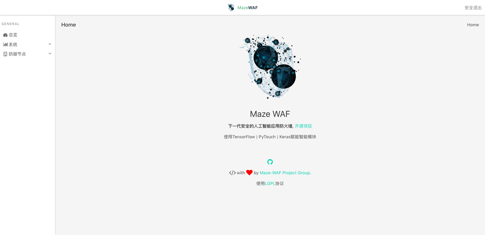

# Maze-WAF
 Next generation artificial intelligence Web Application Firewall

#### DeepLearning
 We creat models with RNN(BiLSTM) and CNN to practice network attact.  
 Tensorflow and PyTorch are used to train our attact model ([ML-TEST](./ML-TEST) is a simple Demo of our ML abality. Core code is under preparation)

- Logo
>

- ScreenShot
>
